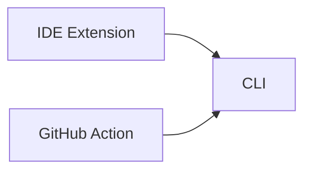

import { Aside } from "@astrojs/starlight/components";

TangleGuard comes with a CLI tool, too.

## Usage

Run `tangleguard --help` to display all available commands and usage.

```bash
tangleguard-cli -l <language> [-p <path>] [--ignore-paths <ignore-paths>] [-q] <command> [<args>]
```

### Commands

| Command    | Description                                                                                                              |
| ---------- | ------------------------------------------------------------------------------------------------------------------------ |
| `upload`   | Upload scan results to TangleGuard Cloud, OSS only, more about [Cloud here](/apps/cloud)                                 |
| `scan`     | Scan the workspace and print the result as JSON to stdout                                                                |
| `validate` | Check the codebase regarding circular dependencies and rule violations, more about [validation here](/features/linter/). |

### Options

| Option           | Short | Description                                                                                     |
| ---------------- | ----- | ----------------------------------------------------------------------------------------------- |
| `--language`     | `-l`  | Programming language to be scanned (required)                                                   |
| `--path`         | `-p`  | Path to the workspace to analyze (defaults to current directory)                                |
| `--ignore-paths` |       | Comma-separated list of directory names to ignore during scanning (e.g., `examples,benchmarks`) |
| `--quiet`        | `-q`  | Suppress all logging output, only print result to stdout (recommended for programmatic use)     |
| `--help`         |       | Display usage information                                                                       |

## Consumers

It is being used by the GitHub Action and the IDE Extensions to scan the codebase.



The core logic of TangleGuard is written in Rust, as are the the scanners.
To make use of this efficient code and not have to re-implement most of the code logic in Javascript or Typescript, the Visual Studio Code Extension usese the compiled, super fast CLI tool to scan your codebase.
