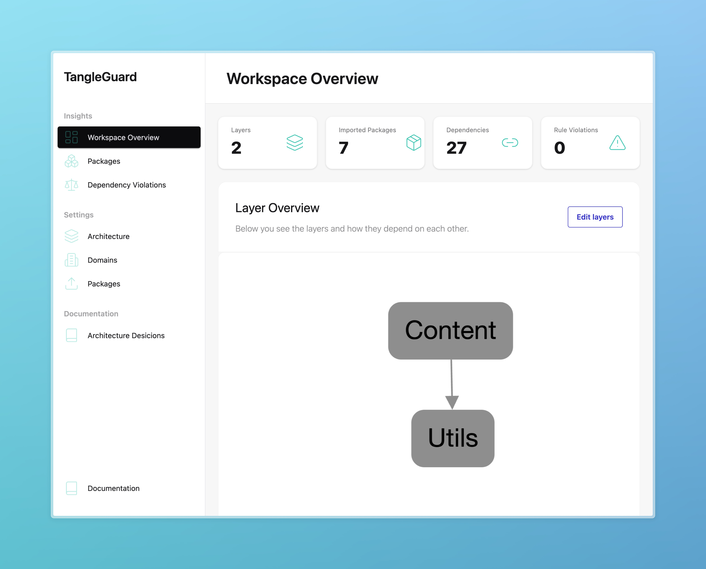
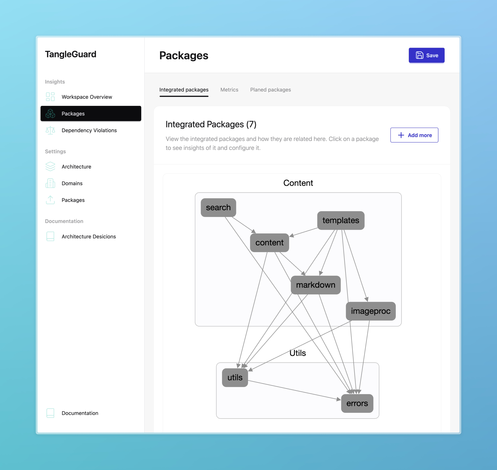
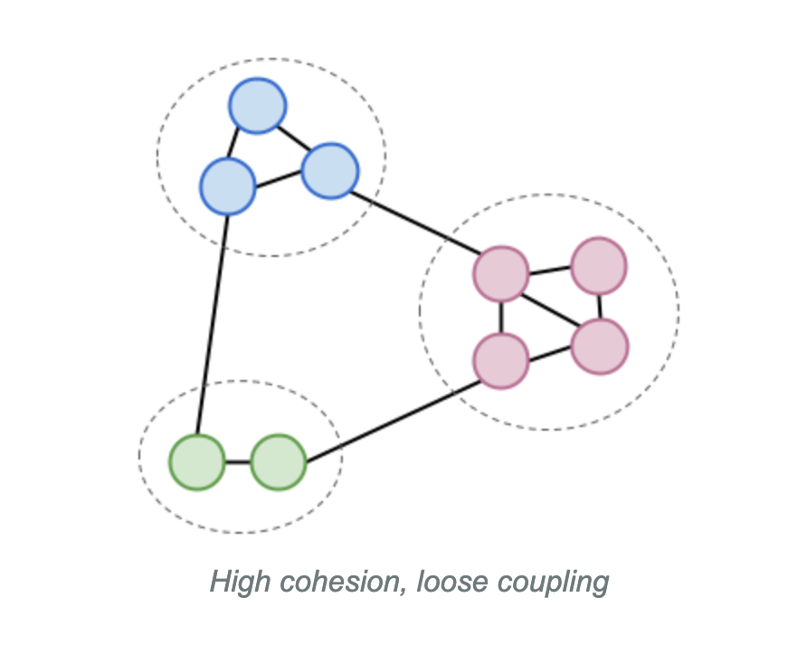
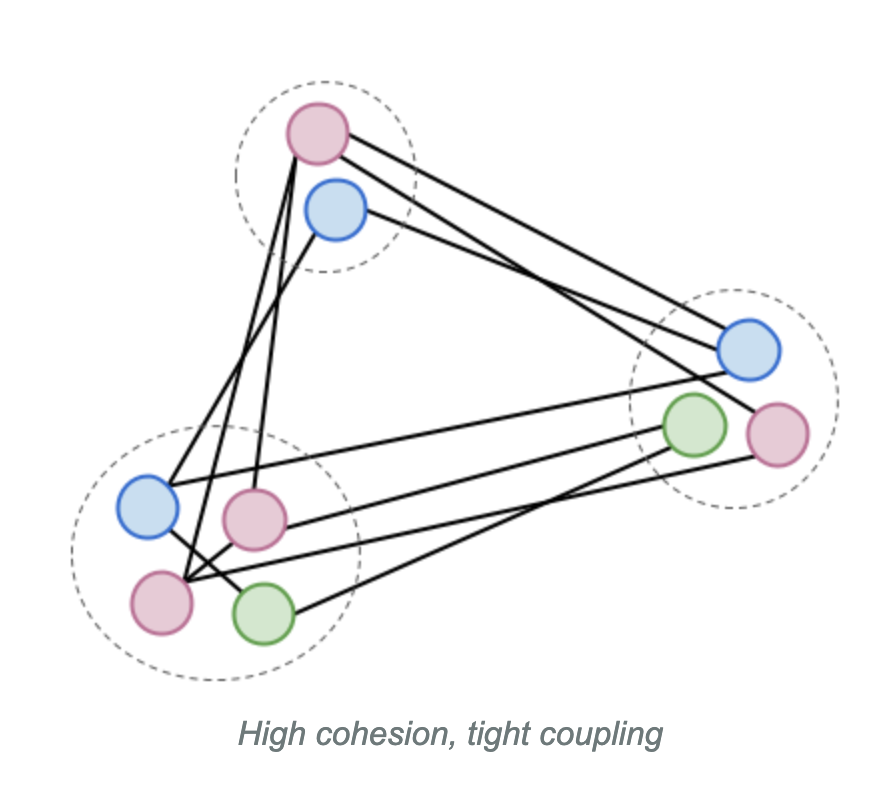
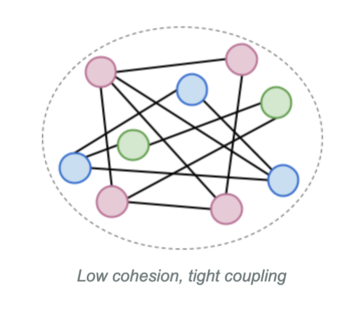

import { Aside } from "@astrojs/starlight/components";

TangleGuard offers the capability to explore the source code as an interactive graph diagram.

It provides you with high level diagrams which reveals the system’s key building blocks and how they depend on one another.

It does all of this by scanning your codebase each time you open a diagram in the designer.
The rendering it done using [Cytoscape.js](https://github.com/cytoscape/cytoscape.js) and the [Dagre layout](https://github.com/cytoscape/cytoscape.js-dagre).

The _Designer_ allows you to browse those diagrams.
Those diagrams are interactive. You can move nodes and layers around as you like. Soon your custom node and layer arrangement will be persisted. Right now TangleGuard recalculates the layout each time a diagram gets opened.

## The Views

There are multiple views in the designer which will be explained next.

<Aside>
  There are two major kinds of diagram currently. Those will be likely be
  combined into one, gigantic unified view
</Aside>

### Workspace Overview

The workspace overview shows you all the packages from the workspace and how they are related to each other.

There's also a **layers overview** which shows you your configured layers and how they depend on each other.

### Package Overview

You can also explore the internals of each package.
In that case, each node of the graph represents a **module**.
The edges represent dependencies between them, so same as for the workspace overview.

You can configure how much nesting you want to see in the package overview.
As per default, the diagram shows you the top level modules first.
Using the slider you have the ability to go **four levels deep**.

## Evaluate the Structure

When using TangleGuard you will see various graph diagrams which show the packages or modules of your application.

Each diagram represents a different view of your architecture, but the main focus is always the coupling and cohesion. With those you can make assumptions about the quality of your system regarding maintainability and flexibility.

- Try to identify how tightly or loosely coupled different parts of your system are.
- Look for patterns of high cohesion within modules — or the lack thereof.
- Diagrams showing high coupling may indicate areas where responsibilities are spread across too many components.
- Loose coupling and strong cohesion typically signal a more maintainable and modular design.

Understanding these diagrams is key to identifying architectural drift, erosion, and opportunities for improvement.

### Easy to maintain

Best you group your source code in a way that the components are cohesive and loosely coupled.
Below you see how this would look like [1].
You get such structure for example when applying domain driven design (DDD).

### Harder to maintain

A simple and common architectural style is the layered architecture as mentioned above.
If you don't separate your code regarding feature or domain concerns, but rather regarding technical concerns, you will end up with a system which looks like the illustration below [1].
For each bug fix or feature you normally have to touch multiple components across the codebase which can easily lead to merge conflicts when working in a team.

### Impossible to maintain

Below you see how an application can look like when you don't separate at all [1].
You can what's often referred to as a "spaghetti code" or "god object".
This is very difficult to understand and hence maintain and proper isolated tests are very hard to write.

## Examples

Here you see some visualization examples of open-source projects.

For each project you'll first see the an overview of the Cargo workspace.
Each node represents a package from the repository.

For some repositories you'll find examples component diagrams of specific packages.
There, each node represents a module.

### ripgrep

https://github.com/BurntSushi/ripgrep

#### Packages

#### grep-cli

#### grep-printer

### Spacedrive

https://github.com/spacedriveapp/spacedrive

#### Packages

#### Core

### Ruff

https://github.com/astral-sh/ruff

#### Packages

#### ruff_formatter

#### ruff_python_formatter

### Vector

https://github.com/vectordotdev/vector

#### Packages

