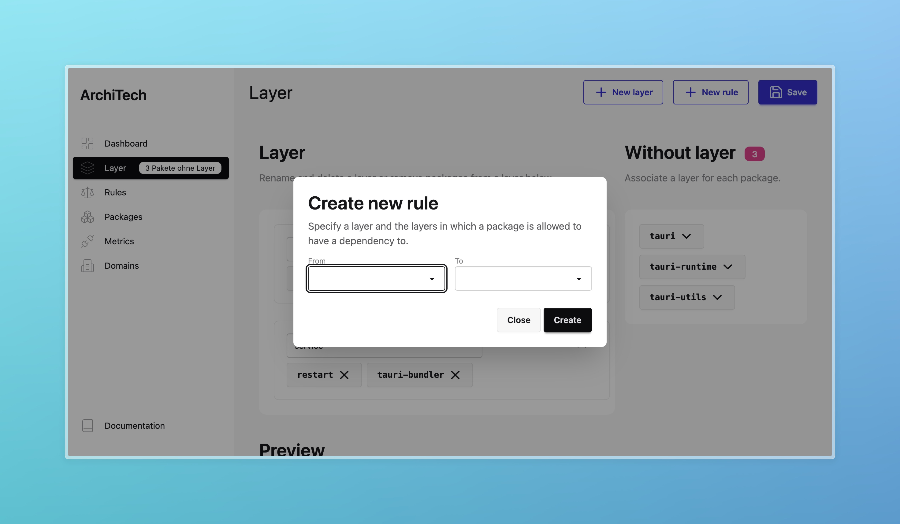

import { Steps } from "@astrojs/starlight/components";
import { Badge } from "@astrojs/starlight/components";
import { YouTube } from "astro-embed";
import { Aside } from "@astrojs/starlight/components";

You can configure dependency rules within the Designer.
Currently, you have those two options:

- Group packages within layers and define how layers can interact with each other
- Define how modules within specific packages can interact with each other

<Aside type="caution">
  TangleGuard is currently being rewritten. The dependency rules are under
  construction.
</Aside>

## Defining Layers

The Designer is a visual editor lets architects create and edit layers.

Currently, depending on where you want to apply a layered architecture, it is done in different ways.

### Layers above Packages

Layers within your workspace are _logic groups of packages_.

The following steps need to be made to create a layered architecture:

<Steps>

1. Create a layer by specifying its name and optionally a description.

2. Associate packages to the layer. There is a list of packages you have to associate to layer. Click on on the package, and select the layer in which the packages belongs out of the dropdown list.

3. Crete the allowed relationship between the new layer and other layers by using _dependency rules_, see below in a later section.

</Steps>

### Layers above Modules

You can also specify layers for a specific package (a library crate or a binary crate.)
In that case a layer _groups modules_.

It is currently handled differently than layers for packages.
When it comes to layers for a specific project, currently those are defined by specifying a directory, which is usually a module. All the nested modules are considered part of the same layer then.

This might change in the future and enhanced so that a layers can be specified by a list of modules, similar to how a layer is specified in the previous section.

<Steps>

1. Create a layer by specifying its name, it's **path**, and optionally a description.

2. Crete the allowed relationship between the new layer and other layers by using _dependency rules_, see below in a later section.

</Steps>

<YouTube id="8p3Ksvdu618" />

## Define Dependency Rules

You can define the layers which a specific layer is allowed to depend on.
Within the same page, click on the New rule button.
A modal appears where you can select from which to which layer a dependency is allowed.

You can view all the existing rules on the rules page.

:::note
If you want to have a horizontal layered architecture, you need to allow a layer to have dependencies to the layers below.
:::

## Templates <Badge text="workspace only" variant="note" />

For a workspace you can choose one of a set of templates. The following templates are available:

- **Horizontal Layered Architecture**: This template creates an user defined amount of layers with a placeholder name and creates dependency rules as follows: A layer is only allowed to use a layer which sits below it.
- **Clean Architecture**: This template creates a clean architecture with layers for the domain, application, and infrastructure, with the dependency rule going "outwards".

which create the layers _and_ the dependency rules for you.
This takes work off your hands then using a horizontal layered architecture or clean architecture.
