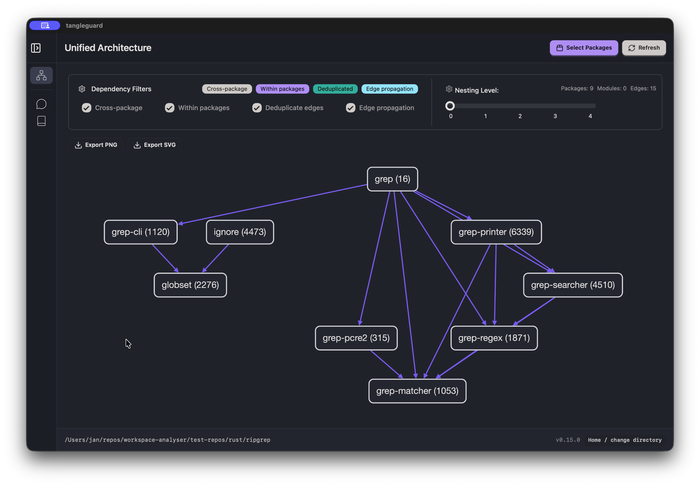
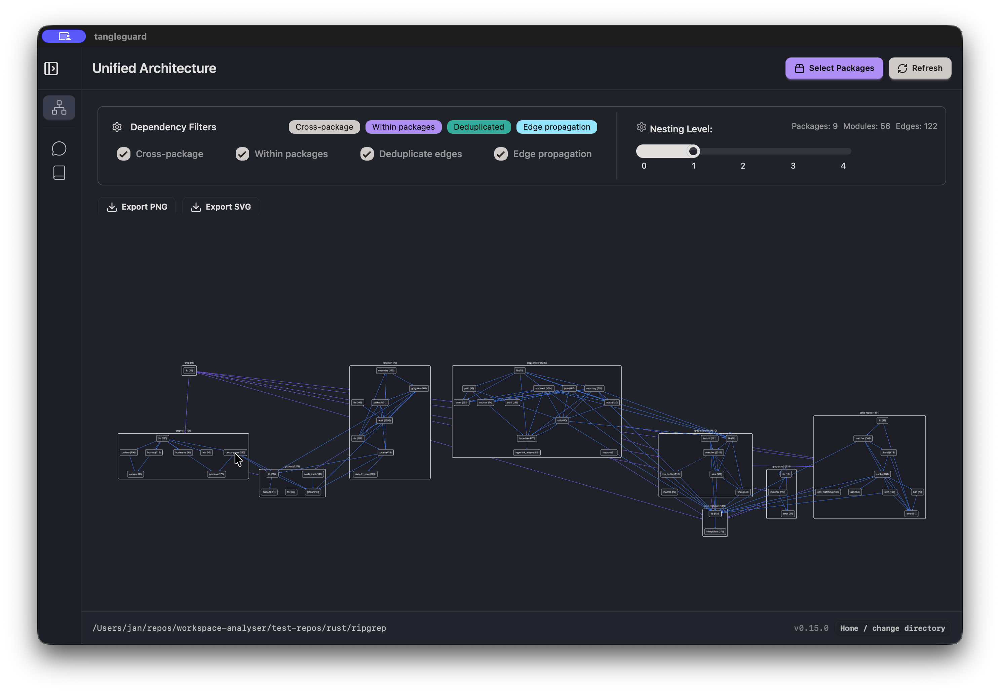

import { Aside } from "@astrojs/starlight/components";

TangleGuard offers the capability to explore the source code as an interactive graph diagram.

It provides you with high level diagrams which reveals the system’s key building blocks and how they depend on one another.
The rendering it done using [Cytoscape.js](https://github.com/cytoscape/cytoscape.js) and the [Dagre layout](https://github.com/cytoscape/cytoscape.js-dagre).

Within the _Designer_ you can browse those diagram and configure it as you need.
Those diagrams are interactive. You can move nodes and layers around as you like. Soon your custom node and layer arrangement will be persisted. Right now TangleGuard recalculates the layout each time a diagram gets opened.

See [cohesion and coupling](/welcome/definitions/#architecture-evaluation) to evaluate the architecture.

## Package Overview

When you first open the diagram, the depth level is set to 0. This means that only the highest level components get shown, which are the packages. You can see how the packages are connected to each other. The number in brackets is the line count of the package.

Below is an example of [ripgrep](https://github.com/BurntSushi/ripgrep).

On the top right, you see a button which opens a model, where you can also select which packages you want to get displayed.

## Module Overview

If you select a depth level more then 0 by using the slider, all the top level modules will be shown in addition to the packages.
You can go 4 levels deep. This might lead to a very large graph.

The edges are solid for a direct dependency, meaning those components are directly connected via an import statement.
The edges are dashed for an indirect dependency, which means that the component has nested components which cause the dependencies to get propagated up to visible node.

You can click on each edges to get the dependencies information displayed in a panel.
In addition, you can configure the edges you want to get displayed, by using the dependency filter.

## Interactivity

You can click on edges to get the dependencies information displayed in a panel.

## Configuration

You can configure the diagram by using the settings available in the dropdown on top of the diagram.
You can configure the kind of edges you want to get displayed, by using the dependency filter, or which packages you want to get displayed, by using the package filter.
