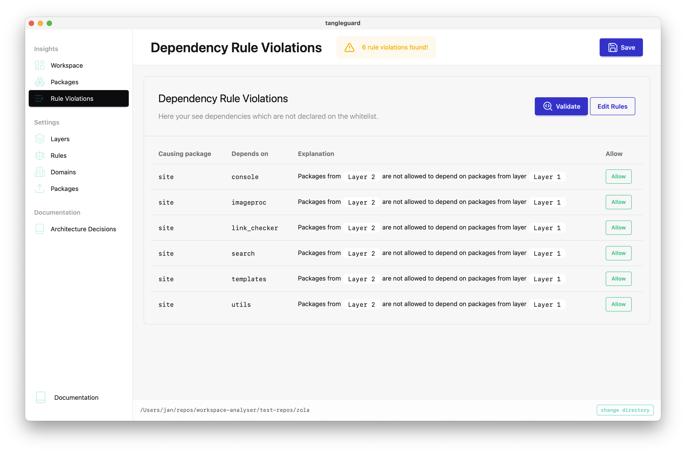

import { LinkCard } from '@astrojs/starlight/components';
import { Image } from 'astro:assets';

TangleGuard is also a structural linter which verifies your source code regarding user-defined rules. That way an architect can enforce the planned architecture. The developers run the CLI tool while working on changes to get notified about violations. It can also be integrated into the CI/CD pipeline. The only rules currently supported are dependency rules between layers.

- **Define layers** and associated packages with those layers
- Define **dependency rules** between layers.

TangleGuard validated your architecture in regards to user defined rules.

The targeted architecture is based on those rule.
TangleGuard makes sure that the source code is aligned the rules and hence with the targeted design.

Head over to `Rule Violations` and click the `Validate` button to get the latest updates.

When a violation is found it usually should be mitigated via a refactoring.
