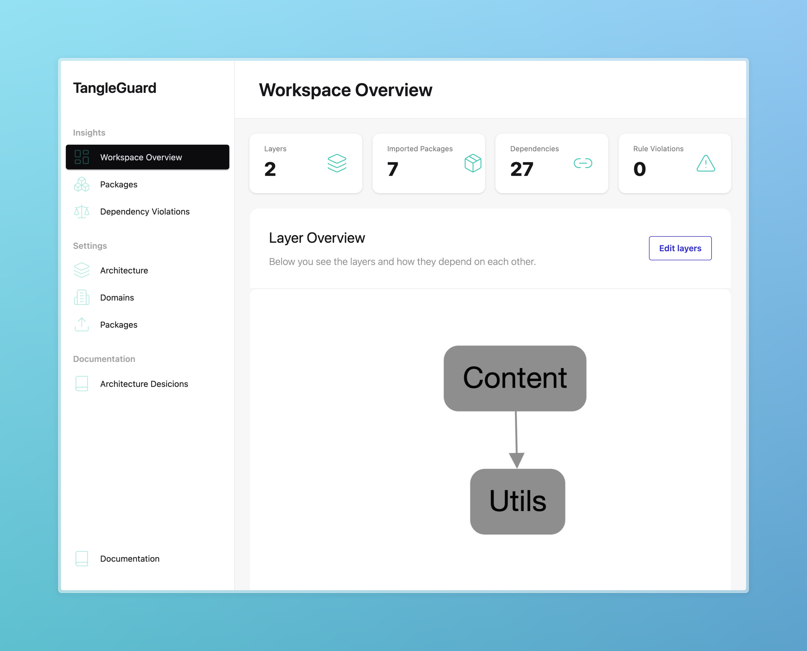
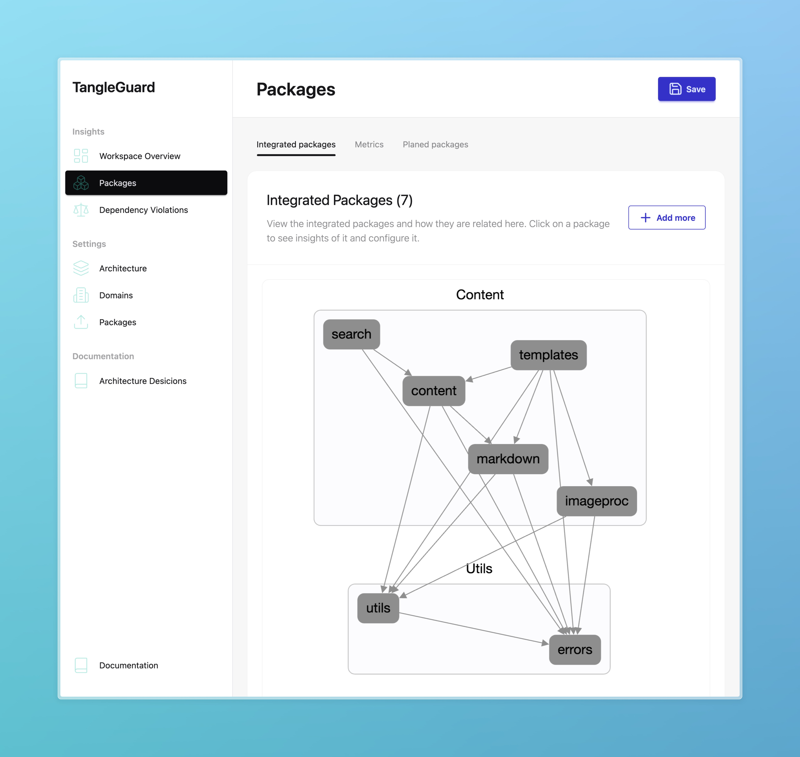

TangleGuard offers the capability to explore the source code as an interactive graph diagram.
It provides you with high level diagrams which shows your declared layers and how their are related to each other and more in depth diagrams for each package, where you can see how your modules are related to each other.

- Workspace visualization as **graph diagram**
- Package and module structure visualizations

TangleGuard reveals the system’s key building blocks and shows you how they depend on one another.
It renders your source code as a directed graph diagram using [Cytoscape.js](https://github.com/cytoscape/cytoscape.js) and the [Dagre layout](https://github.com/cytoscape/cytoscape.js-dagre).

The diagrams are interactive. You can move the nodes and layers around as you like.
Currently it's not possible to save the custom layout but that is a priority item on the [roadmap](/welcome/roadmap/).

## Layers overview
The workspace overview shows the highest level components, which are the layers only.

## Layers and packages
You can also explore the internals of each package.
Each node of the graph represents a package, and the edges represent dependencies between them.

## Modules within a package

## Exmaples

Here you see some visualization examples of open-source projects.

For each project you'll first see the an overview of the Cargo workspace.
Each node represents a package from the repository.

For some repositories you'll find examples component diagrams of specific packages.
There, each node represents a module.

### ripgrep
https://github.com/BurntSushi/ripgrep
#### Packages

#### grep-cli

#### grep-printer

### Spacedrive
https://github.com/spacedriveapp/spacedrive
#### Packages

#### Core

### Ruff
https://github.com/astral-sh/ruff
#### Packages

#### ruff_formatter

#### ruff_python_formatter

### Vector
https://github.com/vectordotdev/vector

#### Packages

