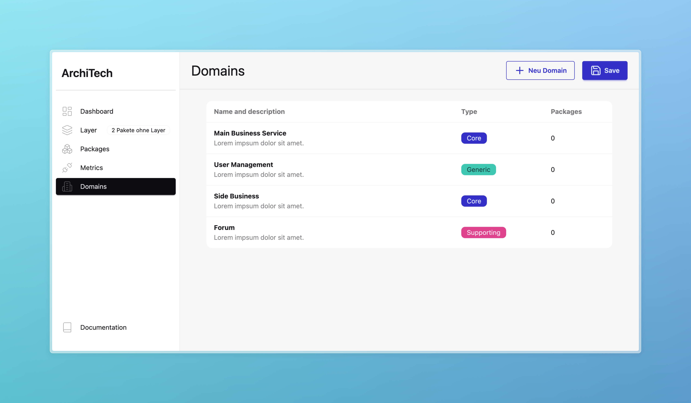

You can define **domains** in tangle-guard to reflect the business logic or responsibilities in your system to add more context to your architecture. Each domain consists of the following:

- A **name**
- A **subdomain type** (e.g., Core, Supporting, Generic)
- A **domain-specific language** 

Once defined, you can **map packages to domains**, so developers know which code belongs to which part of the business.

To assign a domain:

1. Select a package in the editor.
2. Use the right-hand menu (highlighted in blue) to assign it to a domain.

After you defined your domains, you can map packages to specific domains in the editor.
To do so, select a package first.
In the menu on rhe right ( highlighted in blue) you then can select your domain.

