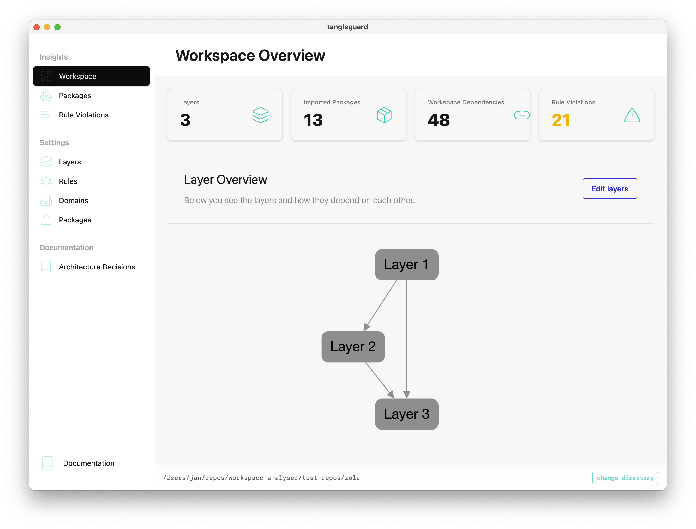
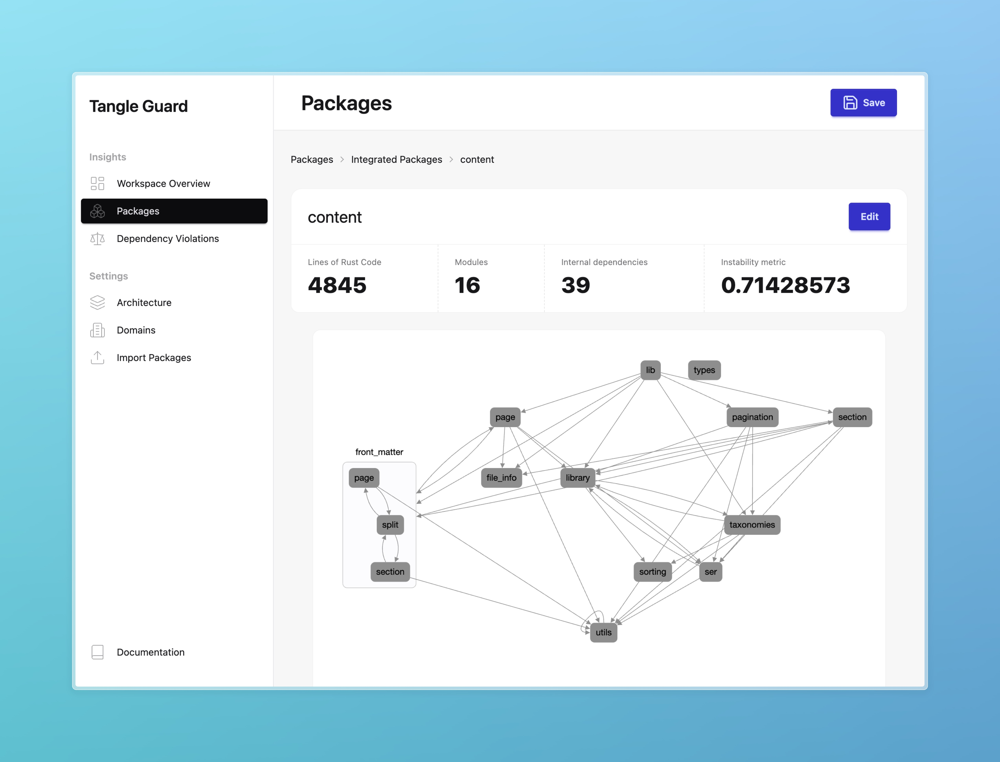
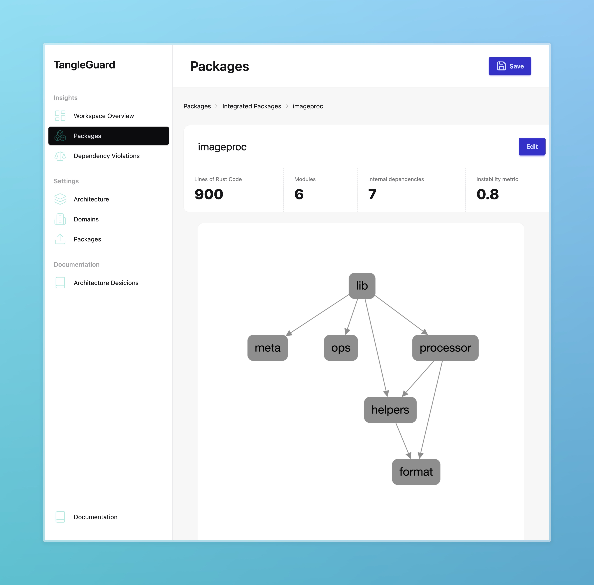

## View layer relationships

You'll see layers and how they are related to each other based on the  package relationships.

## View package relationships

Click on "packages" and see all the integrated packages.

## View module relationships
You can click on each package to go a level deeper.

