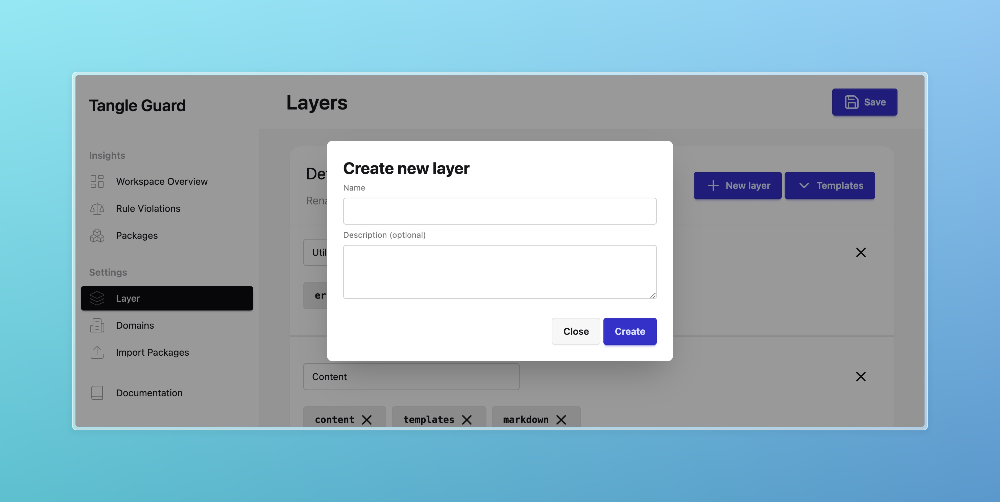
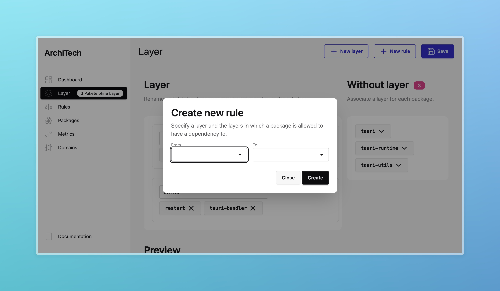

On the side navigation, click on layers.
You can also see a visual preview of your architecture while configuring. Open the UI as follows:

## Define manually
### Layers

The visual editor lets architects create new layers .
architectural models on a canvas by adding elements like layers, packages, and arrows to define allowed dependencies.

Here’s a mockup showing a classic **layered architecture** — with two horizontal layers and one vertical layer for shared components.

The new layer will appear in the list.

### Define dependency rules

You can define the layers which a specific layer is allowed to depend on.
Within the same page, click on the New rule button.
A modal appears where you can select from which to which layer a dependency is allowed.

You can view all the existing rules on the rules page.

:::note
If you want to have a horizontal layered architecture, you need to allow a layer to have dependencies to the layers below.
:::

## Define via Templates
You can use templates which create the layers *and* the dependency rules for you.
This takes work off your hands then using a horizontal layered architecture or clean architecture.

## Add packages to a layer

Once a layer is created, it is empty. Next, you'll need to add packages to the layers.
One the right, there is a list with all packages which are not associated with a layer yet.
Click on on the package, and select the layer in which the packages belongs out of the dropdown list.

## Rename a layer

You can edit the name of the layer just by changing the name of the input field.

