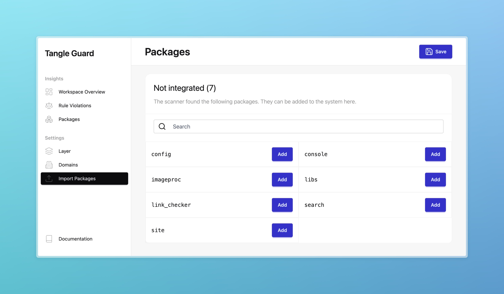
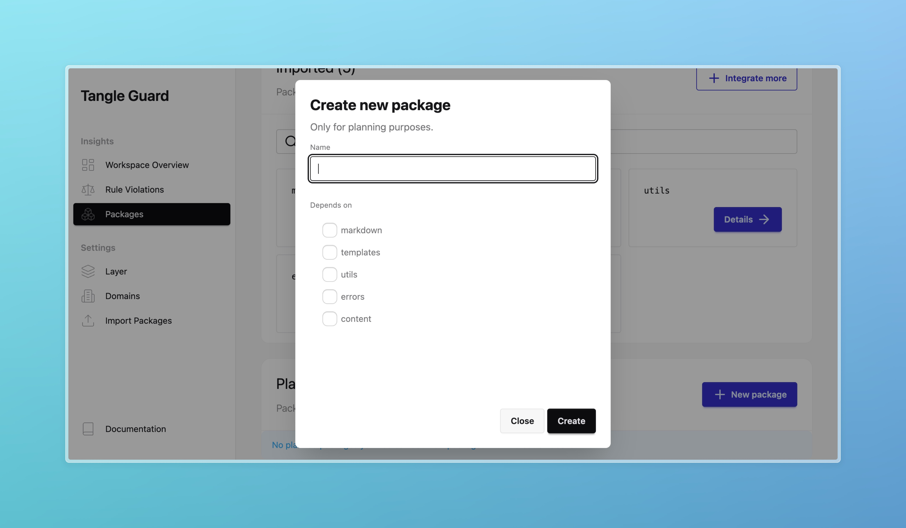

Packages obviously play a huge rule in the whole architecture.
When you first start the tool, ypu have to integrate the packages of your choice into the system. 

## How to integrate packages

The packages and dependencies get created in your architecture in two different ways:

- Define components yourself **before** the implementation starts (to use it as planning tool and as document which can be applied to the developers)
- Deine the components **after** they've been implemented (for documentation and further management and governance).

### Add existing packages
You need to integrate each package you want to manage.
In the Import Package settings there is a list of all packages which the scanner has found:

Afterwards you can navigate to the packages page, where you see all your integrated packages.

### Add new packages

