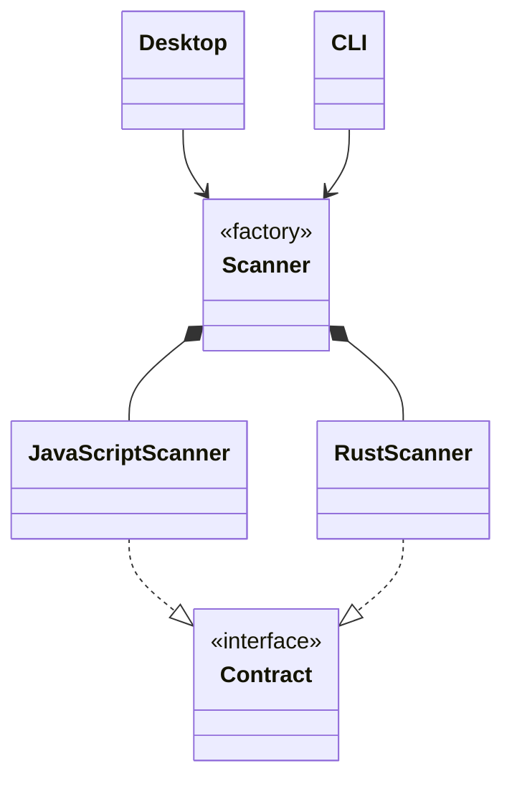

A major part of TangleGuard are the scanners. They are written in Rust and hence very fast and reliable. They traverse the file system and look for components and their references to other components and creates an architecture abstraction.

This abstraction is used to create the visualization.

Currently those two languages

- Rust
- JavaScript/TypeScript

Go is planned.

