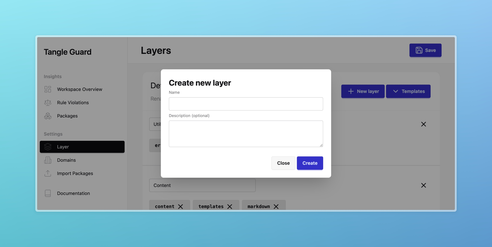
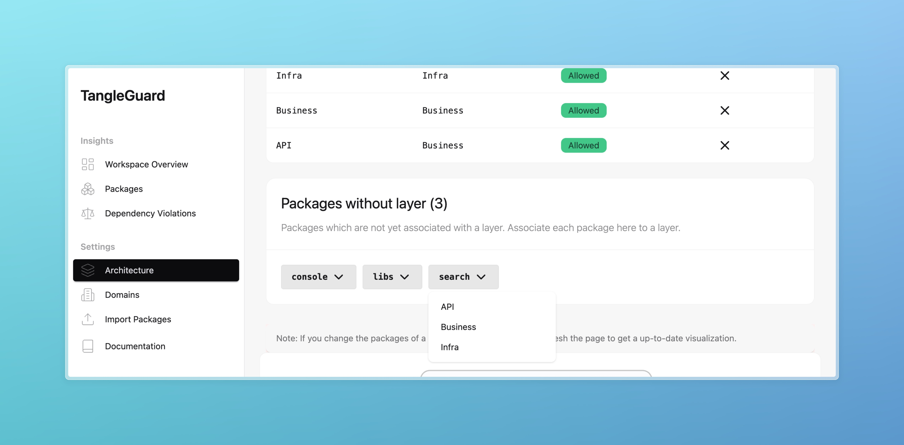
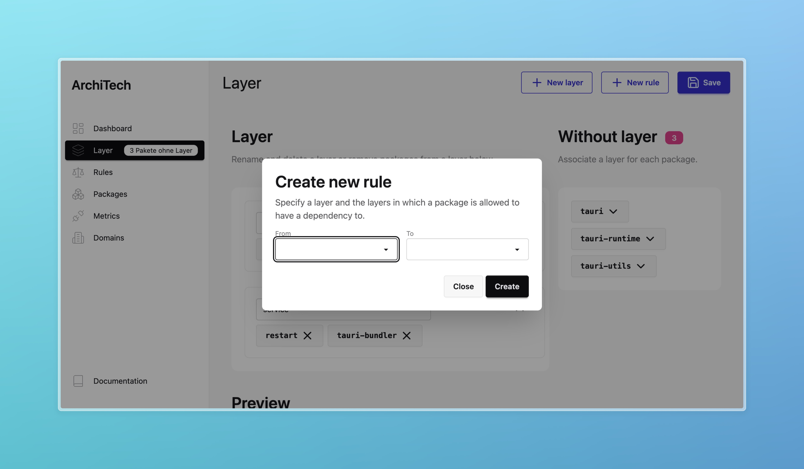

import { LinkCard } from '@astrojs/starlight/components';
import { Steps } from '@astrojs/starlight/components';
import { Aside } from '@astrojs/starlight/components';

TanlgeGuard is the place for you see all visualizations and where you can configure and document your architecture.

When opening TangleGuard for a specific codebase for the first time, it will create a [configuration file](/start/configuration).
Add this file to your repository.
It is supposed to be committed.

<Steps>

1. **Integrate packages**
You need to integrate specific or all packages of your workspace into the system.

2. **Define Layers**
Then define some layers and add packages to those layers.

3. **Define rules**
You probably want to define some rules for the layers you defined, like layerX is allowed to depend on layerY.

4. **Validate**
Then you can run violation checks and see if the codebase is aligned with the targeted design.

</Steps>

## First, Define your Architecture
To be able to detect architecture erosion, TangeGuard needs to know about your target architecture.
You can define the goals and building groups of your application via a nice UI.
Choose the path to a [Cargo workspace](https://doc.rust-lang.org/book/ch14-03-cargo-workspaces.html).

When you select a workspace for the first time with TangleGuard, it will create a [configuration file](/start/configuration/) for you.
Any configuration you make will be stored in  that file.
Please add the configuration file into the your Git repository.

### Define Layers
Layers should be the fundamental building blocks of your architecture.
They are a high-level building block. The can group packages.

### Add packages to the layers
The next step would be to add packages to the layers.
To do that, the packages need to be integrated first.
See settings -> Packages in the side nav.

Within the architecture settings, you'll find a list of packages which are not yet associated with any layer.
Click on the package to add it to a layer.

### Define Rules
Set rules for dependencies between layers.
Soon you'll be able to declare dependency rules between packages, too!

Now everything is set up and you can start validating your architecture.

## Then, Validate your Architecture regularly
The dependency rule section will show you all rule violations in your source code, based on your defined rules.
TangleGuard traverses your source code and check the dependencies against the rules.

Once a violation is found, it can be fixed.
There will be no violation when the fix comply with the architecture rules.
It could also be sufficient to apply changes in the rule system.

<Aside type="tip">
You can also run the violation check in the WEB UI and see the results there.
</Aside>
