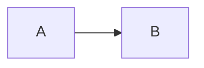
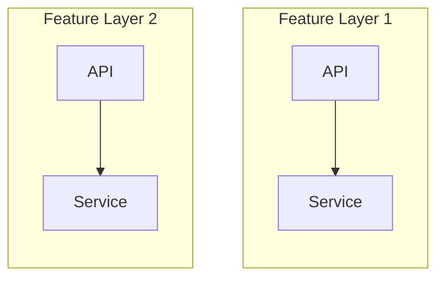
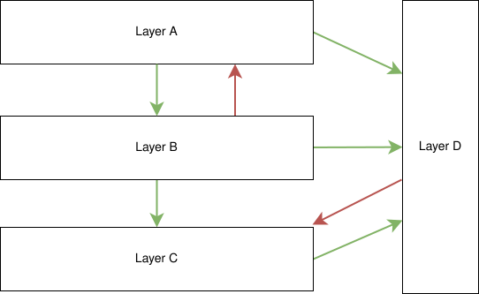

import { Aside } from "@astrojs/starlight/components";
import { CardGrid, Card } from "@astrojs/starlight/components";
import Collapsible from "../../../components/Collapsible.astro";

There are also different _views_ on architecture, for example the deployment view or the runtime view.
In TangleGuard we focus on components and the static relationships within the the source code of an application.

Here, software architecture consists of the following things.
Architecture can feed abstract although it is very concrete and practical once you get the hang of it.
To make it more tangible, visualization help help massively.
It makes talk about the design easy and is a way to communicate a architecture which someone has in mind.

## Components

In software development, the source code should be separated in one way or the other.
Therefore you need to introduce boundaries which specify those separations.
In TangleGuard components are one of the following:

- **modules**
- **packages**
- **layers**

Below You see two component `A` and `B`.
Component `A` depends on component `B`.
Components are visualized as rectangle whereas the dependency is visualized by the arrow as follows:


```mermaid
flowchart LR
  A --> B
```

For actual, real world examples, you can check out these [examples](/features/visualization/#exmaples) made with TangleGuard.

## Dependencies

Whatever you choose as container to group your logic, it needs to interact with other component. Which component is being used by another component is specified via a dependency.

## Layers

A layer is a logical group of components, which groups similar components together.
They also come with the constraint of only having specific dependencies between them.

Layers are implemented in TangleGuard in two ways:

- For a workspace, a layer is defined by a group of packages
- For a single crate, a layer is defined as a directory

Below are some general information about layers.

<Collapsible title="Technical Layers">
    For a classical layered architecture, layers are usually arranged in a hierarchy.
    Layers are only allowed to depend on layers below them.

    ```mermaid
    flowchart TD
      LayerA --> LayerB
      LayerB --> LayerC
    ```

    Let's see an concrete example.

    ```mermaid
    flowchart TD
        subgraph UI [API Layer]
            A[REST]
            B[GraphQL]
        end

        subgraph Service [Service Layer]
            C[Reports]
            D[Calculation]
        end

        subgraph Data [Data Layer]
            E[(Database)]
            F[(Cache)]
        end

        A --> C
        B --> C
        C --> D
        C --> E
        D --> F
    ```

    Those groups can consists of technical components, like an `API` layer consisting of `REST` and `GraphQL` components.
    We reference to those layers as **technical layers** or **horizontal layers**.
    They are used by across business domains.
    They are visualized as wide, shallow blocks in the architecture diagram.

</Collapsible>

<Collapsible title="Domain or Feature Layers">

Layers can also consists out of feature components, which usually implement certain business logic.
An example of a domain layer would be to have a `User` layer.
It contains all components related to that user domain, like the API, models, services, etc.
They are also called **vertical layers** - they cut through the horizontal layers.

Below you see two vertical layers `A` and `B`.


```mermaid
flowchart TB
    subgraph F1 [Feature Layer 1]
      direction TB
      A[API]
      B[Service]
    end

    subgraph F2 [Feature Layer 2]
      direction TB
      C[API]
      D[Service]
    end

    A --> B
    C --> D
```

</Collapsible>

## Dependency Rules

Rules define to which components a specific component is allowed to depend on.
Currently in TangleGuard, you can define the `depends_on` relationship between components.

This is the fundament of the validator which keep your architecture in place.

Here's how ti can be visualized:
_Allowed_ dependencies are marked in green.
_Not Allowed_ dependencies are marked in red.



## Cohesion and Coupling

Cohesion and coupling are two important concepts in software architecture that help to ensure that components are well-designed and maintainable.

Cohesion refers to the degree to which the elements within a component are related to each other. A component with high cohesion has a clear and well-defined purpose, and its elements work together to achieve that purpose. On the other hand, a component with low cohesion has elements that are loosely related and may not contribute to the overall purpose of the component.

Coupling refers to the degree to which components are dependent on each other. A component with high coupling has a strong dependency on other components, which can make it difficult to modify or replace individual components without affecting the entire system. On the other hand, a component with low coupling has a weak dependency on other components, which makes it easier to modify or replace individual components without affecting the entire system.

For more details, visit https://blog.ttulka.com/how-cohesion-and-coupling-correlate/ - this blog contains a an excellent introduction to cohesion and coupling.

Depending on those characteristics, the architecture is either easy and cost efficient to maintain and or hard and expensive to maintain.


### Architecture Evaluation

When using TangleGuard you will see various graph diagrams which show the packages or modules of your application.

Each diagram represents a different view of your architecture, but the main focus is always the coupling and cohesion. With those you can make assumptions about the quality of your system regarding maintainability and flexibility.

- Try to identify how tightly or loosely coupled different parts of your system are.
- Look for patterns of high cohesion within modules — or the lack thereof.
- Diagrams showing high coupling may indicate areas where responsibilities are spread across too many components.
- Loose coupling and strong cohesion typically signal a more maintainable and modular design.

Understanding these diagrams is key to identifying architectural drift, erosion, and opportunities for improvement.

### Easy to maintain

Best you group your source code in a way that the components are cohesive and loosely coupled.
Below you see how this would look like [1].
You get such structure for example when applying domain driven design (DDD).


### Harder to maintain

A simple and common architectural style is the layered architecture as mentioned above.
If you don't separate your code regarding feature or domain concerns, but rather regarding technical concerns, you will end up with a system which looks like the illustration below [1].
For each bug fix or feature you normally have to touch multiple components across the codebase which can easily lead to merge conflicts when working in a team.


### Impossible to maintain

Below you see how an application can look like when you don't separate at all [1].
You can what's often referred to as a "spaghetti code" or "god object".
This is very difficult to understand and hence maintain and proper isolated tests are very hard to write.


## Sources

[1] https://blog.ttulka.com/how-cohesion-and-coupling-correlate/
