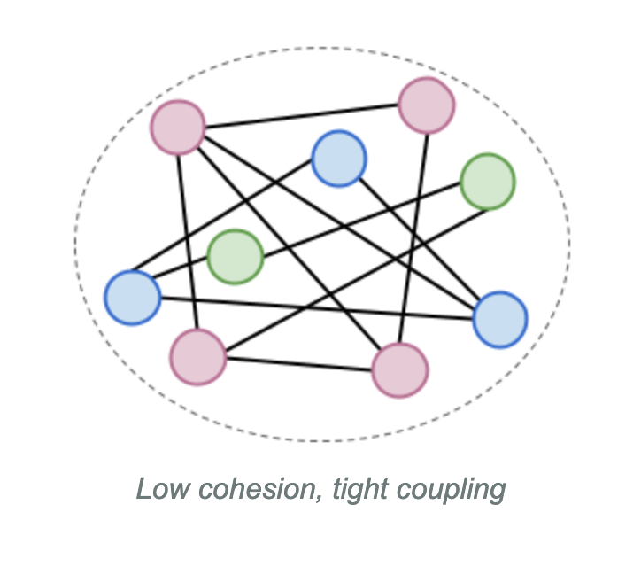

import { Aside } from '@astrojs/starlight/components';
import { CardGrid, Card } from '@astrojs/starlight/components';

There are also different *views* on architecture, for example the deployment view or the runtime view.
In TangleGuard we focus on components and the static relationships within the the source code of an application.

Here, software architecture consists of the following things.
Architecture can feed abstract although it is very concrete and practical once you get the hang of it.
To make it more tangible, visualization help help massively.
It makes talk about the design easy and is a way to communicate a architecture which someone has in mind.

## Components

In software development, the source code should be separated in one way or the other.
Therefore you need to introduce boundaries which specify those separations.
In TangleGuard components are one of the following:
- **modules**
- **packages**
- **layers**

Below You see two component `A` and `B`.
Component `A` depends on component `B`.
Components are visualized as rectangle whereas the dependency is visualized by the arrow as follows:

A more realistic example would be this:

For actual, real world examples, you can check out these [examples](/welcome/examples) made with TangleGuard.

## Dependencies

Whatever you choose as container to group your logic, it needs to interact with other component. Which component is being used by another component is specified via a dependency.

## Layers

A layer is a logical group of components.
Those groups can consists of technical components, like an `API` layer consisting of `REST` and `GraphQL` components.
We reference to those layers as **technical layers** or **horizontal layers**.
They are used by across business domains.
They are visualized as wide, shallow blocks in the architecture diagram.

Layers can also consists out of feature components, which usually implement certain business logic.
An example of a domain layer would be to have a `User` layer.
It contains all components related to that user domain, like the API, models, services, etc.
They are also called **vertical layers** - they cut through the horizontal layers.

Below you see two horizontal layers `A` and `B` and one vertical layer `C`.

## Dependency Rules
To have a well-defined architecture, you need to define rules which specify which component is allowed to depend on which other component.
This is how you'll be able to keep your architecture clean and maintainable.
TangleGuard currently supports a whitelist which specifies which layers another layer can depend on.

Here's how ti can be visualized:
_Allowed_ dependencies are marked in green.
_Not Allowed_ dependencies are marked in red.

## Cohesion and Coupling
Cohesion and coupling are two important concepts in software architecture that help to ensure that components are well-designed and maintainable.

Cohesion refers to the degree to which the elements within a component are related to each other. A component with high cohesion has a clear and well-defined purpose, and its elements work together to achieve that purpose. On the other hand, a component with low cohesion has elements that are loosely related and may not contribute to the overall purpose of the component.

Coupling refers to the degree to which components are dependent on each other. A component with high coupling has a strong dependency on other components, which can make it difficult to modify or replace individual components without affecting the entire system. On the other hand, a component with low coupling has a weak dependency on other components, which makes it easier to modify or replace individual components without affecting the entire system.

For more details, visit https://blog.ttulka.com/how-cohesion-and-coupling-correlate/ - this blog contains a an excellent introduction to cohesion and coupling.

Depending on those characteristics, the architecture is either easy and cost efficient to maintain and or hard and expensive to maintain.

### Easy to maintain
Best you group your source code in a way that the components are cohesive and loosely coupled.
Below you see how this would look like [1].
You get such structure for example when applying domain driven design (DDD).

### Harder to maintain
A simple and common architectural style is the layered architecture as mentioned above.
If you don't separate your code regarding feature or domain concerns, but rather regarding technical concerns, you will end up with a system which looks like the illustration below [1].
For each bug fix or feature you normally have to touch multiple components across the codebase which can easily lead to merge conflicts when working in a team.

### Impossible to maintain
Below you see how an application can look like when you don't separate at all [1].
You can what's often referred to as a "spaghetti code" or "god object".
This is very difficult to understand and hence maintain and proper isolated tests are very hard to write.

## Sources
[1] https://blog.ttulka.com/how-cohesion-and-coupling-correlate/
