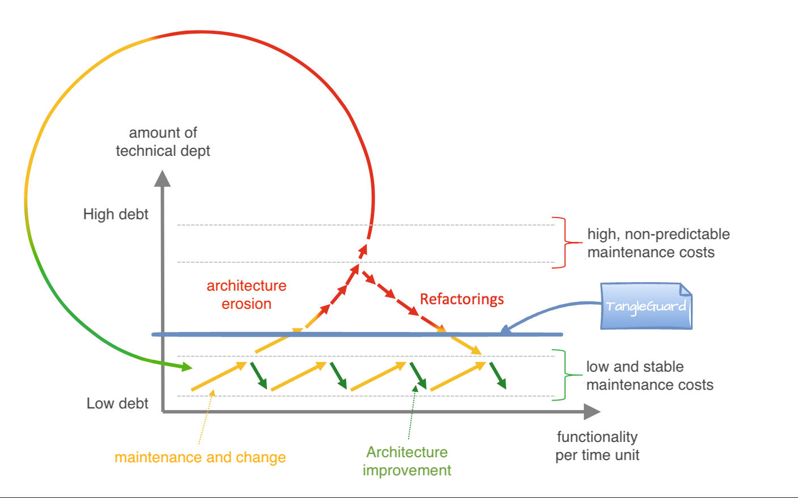

import CustomCard from '../../../components/studies.astro';
import { Aside } from '@astrojs/starlight/components';

Good architecture is what makes a system scalable, maintainable, and understandable. It’s not just for big enterprises or legacy systems—it’s essential from day one if you want to build software that lasts.

As software evolves, the codebase grows rapidly — often without an intentional structure. Major design decisions get made passively, and little time is spent thinking about how to divide the system into small, maintainable components.
The result? A system that’s **hard to understand, harder to maintain**, and expensive to scale.
Studies show developers spend up to **70%** of their time just trying to understand existing code — a huge cost in real-world teams.

This is where software architecture pays off.
By creating **strict, meaningful boundaries**, you reduce technical debt and cognitive overhead — especially in teams with many developers working in parallel.
Overall, **human resources should be kept at a minimum.**

## Architecture Erodes Over Time

Architecture rarely dies in a big bang — it rots slowly.
Developers make quick fixes. Deadlines push best practices aside.
A new shortcut here, a minor exception there.
This incases the technical debts and although it makes live easier in teh beginning, it can make the live of the whole team very painful in the long run.
TangleGuard stops to create technical/architectural debts to keep the maintenance costs low.

The below diagram from [1] summarizes this.

[1] C. Lilienthal - _Langlebige Software-Architekturen: Technische Schulden analysieren, begrenzen und abbauen_, dpunkt.verlag (2024), ISBN: 9783988901361. https://www.langlebige-softwarearchitekturen.de/

Eventually, the original design gets buried under layers of “just this once.”
That’s architecture erosion—and it happens commit by commit.
Without constant attention, even the best architecture falls apart.

## Erosion reduces Productivity
Case studies published by Robert C. Martin in it's book <i>Clean Architecture: A craftsman’s guide to software structure and design</i> has shown that this erosion does costs companies quite some money.

<CustomCard>Components can also contain **nested content**.</CustomCard>

<Aside type="caution" title='The Result: Rising Costs' >The result of erosion is that of costs the company an extreme amount of money.</Aside>

## TangleGuard Stops the Erosion

With tangle-guard, you can **limit architectural erosion** in your application — keeping maintenance costs from rising uncontrollably.

- Defined in a clear, structured format
- Governed by enforceable rules
- Integrated into the CI/CD process

So when someone adds an unauthorized dependency or breaks a boundary, they find out immediately—not six months later in a refactoring death spiral.
Architecture shouldn’t live in a slide deck—it should live in your pipeline.

tangle-guard helps modern dev teams to **manage their software architecture before it erodes into unmaintainable complexity**.
You can define architectural boundaries, enforce them continuously, and evolve them safely as your codebase grows.
That way you maintenance costs are kept low from the beginning.

tangle-guard is built for software teams working on **modular** monolithic applications within a monorepo.
Whether you're designing a new system or wrangling legacy complexity, it gives you a visual, enforceable way to define and manage architecture.
It ensures your **design boundaries are respected**, no matter how fast your team is shipping — or how many developers are pushing code simultaneously.

Think of it as a lightweight SonarQube, but for architecture - leaner, modern, and laser-focused on **code structure**, not code style or implementation details.
