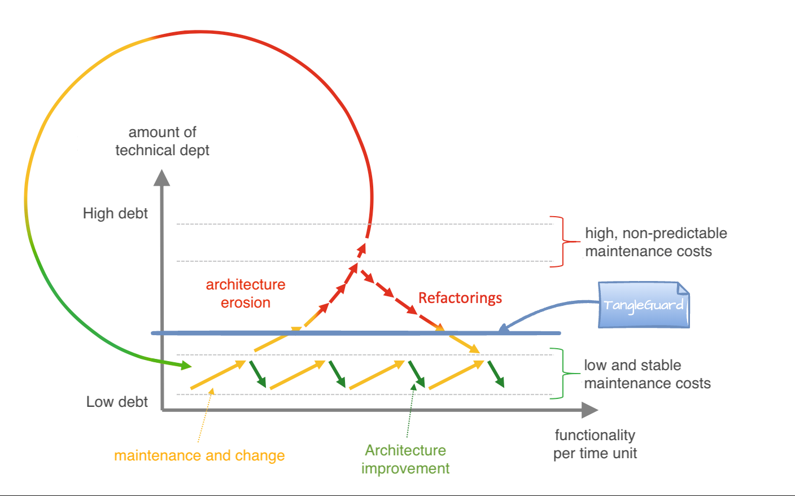

import CustomCard from "../../../components/studies.astro";
import { Aside } from "@astrojs/starlight/components";

Good architecture makes software scalable, maintainable, and understandable. It's essential from day one—not just for big enterprises.

## Architecture erodes over time

Erosion in regards to software architecture is a gradual process that can lead to an inefficient maintenance burden. It's **hard to maintain and not flexible**.
Studies show developers spend up to **70%** of their time just understanding existing code.

Usually the amount of technical debts rises over the years.
Without architecture guidance the structure of a codebase can become like spaghetti which is hard to maintain and barely flexible.

_Source: C. Lilienthal - Sustainable Software Architecture - Analyze, limit and reduce technical debt_ (the blue colored content was added by Archwise Solutions U.G.)

This erosion reduced the productivity and increases the costs per line of code.
Less code can be developed and hence less features can be added.

<CustomCard />
_Source: Robert C. Martin - Clean Architecture_

## TangleGuard stops the erosion

TangleGuard **stops architectural erosion** and reduced the risk of having a tangled code structure before it becomes hard to maintain:

- **Define** clear architectural boundaries
- **Enforce** them automatically in CI/CD
- **Catch** violations immediately—not months later
- **Keep** maintenance costs low from day one

Think of it as lightweight architecture governance—modern, focused on **code
structure**, not implementation details.

Architecture shouldn't live in slide decks. It should live in your pipeline, protecting your codebase as it grows.
