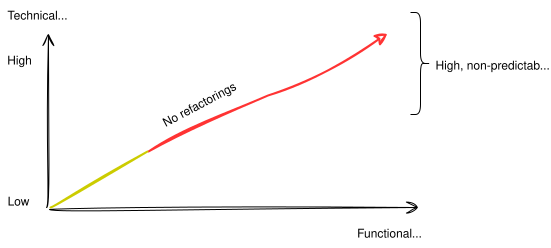
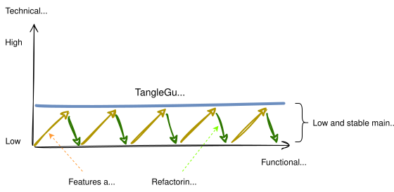

import { Aside } from "@astrojs/starlight/components";

## Enforcement of Architectural Boundaries

Architecture rarely dies in a big bang — it rots slowly. Developers make quick fixes. Deadlines push best practices aside. A new
shortcut here, a minor exception there. Although it makes live easier in the beginning, it can make the live of the whole team
very painful in the long run since the technical debts increase slowly but steadily.

The diagram below illustrates this. Whereas the maintenance effort is low in the beginning, since it increases slowly the whole time it becomes a maintenance hell if the architectural debts are not addressed by refactorings.

It's called <b>architecture erosion</b>. It happens when developers make changes without considering the overall architecture of the system. Doing this over months and years can lead to a situation where the codebase becomes difficult to understand and maintain.`

### Consequences of Architecture erosion

- Reduced Productivity
- Higher Maintenance Costs
- Less Flexibility
- Less Scalability
- Less Agility
- Less Competitiveness

It's usually not possible that one architect can review each and every pull request. Often he/she is the only one who knows the target design and can provide valuable feedback.

### TangleGuard Keeps the Effort Low

To overcome this problem, we need to establish clear boundaries and enforce them. Enforcing them manually through code reviews is highly error prone. It's unpractical that someone from the team checks ALL the code creates a simple diagram out of it. Therefore it should be done automatically and integrated in the developer workflow.

<Aside>
  TangleGuard allows to defined a target architecture and keeps it in place
  automatically.
</Aside>

Within TangleGuard, you can define your target structure and then enforce it automatically over the long run, without manual reviews.

How you set up your target architecture and how the erosion detection works in detail, is explained in the documentation, <a class="link" href="https://docs.tangleguard.com/start/firststeps/">see here</a>

AI-generated code can therefore also validated against the architectural rules.

## Auto. Documentation

Software often consists of many components that interact with each other. Multiple hundreds of lines of code are commons for a
codebase.

Trying to create and maintain a component diagram is usually unpractical. It takes a lot of valuable time. It would need to be
checked if all the components are still there and to update their relations.

That's why such diagrams are not getting created at all. On <a href="https://structurizr.com/">structurizr.com</a>, less than 5%
of workspaces included a component diagrams because of this time consuming task.

### TangleGuard generates diagrams automatically

TangleGuard scans the codebase within seconds. It's written in Rust and traverses each line of your codebase in a fraction of
seconds. It then creates component diagrams automatically. That saves days of manual work.

Obviously, the most value it provides when the architecture is defined nicely. If it looks like spaghetti, it's hard to understand
visually and logically.

<Aside>
  Understanding your architecture enables you to organize teams effectively,
  reducing coordination overhead and enabling autonomous development.
</Aside>

### Architecture-Driven Team Structure

When you clearly understand your codebase's boundaries and dependencies, you can structure your teams to align with these natural
divisions. This approach reduces conflicts, minimizes coordination needs, and allows teams to work independently.

Key Benefits:

- Reduced Inter-team Dependencies:Teams can work on separate architectural components without blocking each other
- Clear Ownership Boundaries: Each team knows exactly which parts of the system they're responsible for
- Autonomous Development: Well-defined boundaries enable teams to make decisions independently
- Faster Development Cycles: Less coordination means faster feature delivery

### Conway's Law in Practice

Conway's Law states that "organizations design systems that mirror their own communication structure." TangleGuard helps you
reverse this - use your existing system structure to inform optimal team organization.

> Any organization that designs a system will produce a design whose structure is a copy of the organization's communication structure." - Melvin Conway

### How TangleGuard Enables This

TangleGuard analyzes your codebase to identify:

- Module boundaries that could define team responsibilities
- Coupling patterns that reveal which components should be owned by the same team
- Dependency flows that inform team interaction patterns
- Architectural layers that suggest organizational structure

### From Analysis to Action

Use these insights to:

- Define team boundaries based on architectural components
- Assign ownership of specific modules or services to teams
- Minimize cross-team dependencies by identifying tightly coupled areas
- Plan team interactions based on component dependencies
- Scale your organization while maintaining architectural integrity

<Aside>
  Teams that align with architecture can move faster, with less friction, and
  greater autonomy - leading to better software and happier developers.
</Aside>
